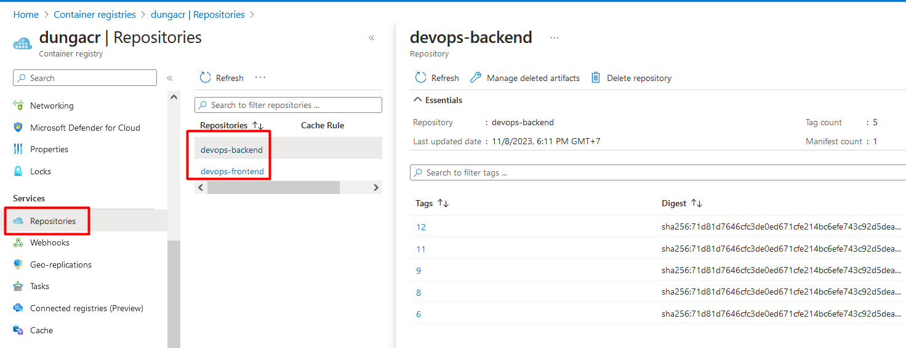
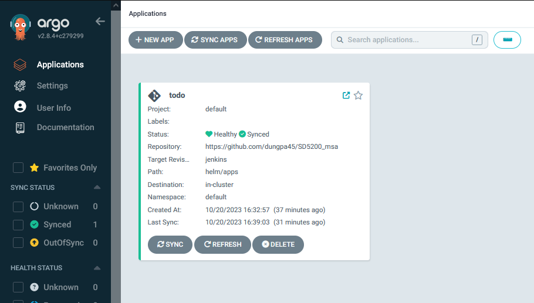
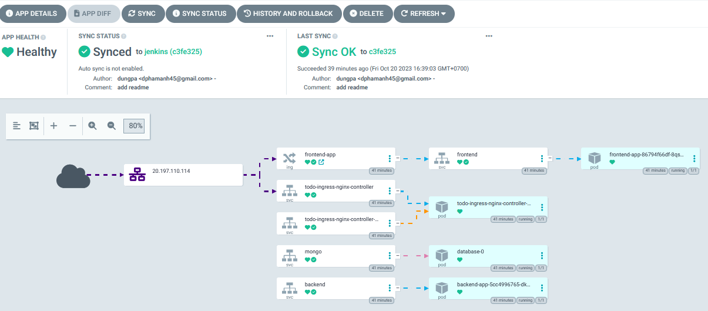

# SD5200_msa

[Managed K8s with Helm](https://github.com/dungpa45/SD5200_msa/tree/jenkins/helm)

This repo is used for both programs **DevOps for Devs** and **Pi-sharp**

and I use this Jenkins setup for both

## Installation

> You should choose the virtual machine have >=1vCPU and >=2Gb RAM

### Install Docker

```
sudo mkdir -p /etc/apt/keyrings
curl -fsSL https://download.docker.com/linux/ubuntu/gpg | sudo gpg --dearmor -o /etc/apt/keyrings/docker.gpg
echo \
  "deb [arch=$(dpkg --print-architecture) signed-by=/etc/apt/keyrings/docker.gpg] https://download.docker.com/linux/ubuntu \
  $(lsb_release -cs) stable" | sudo tee /etc/apt/sources.list.d/docker.list > /dev/null
sudo apt-get update -y
sudo apt-get install docker-ce docker-ce-cli containerd.io docker-compose-plugin -y

sudo usermod -aG docker $USER
grep docker /etc/group
sudo newgrp docker
sudo chmod 777 /var/run/docker.sock
```

### Install Jenkins

Using this image on dockerhub

<https://hub.docker.com/_/jenkins/>

`docker run --name myjenkins -p 8080:8080 -p 50000:50000 -v /your/home:/var/jenkins_home jenkins`

Or install Jenkins manually

<https://www.jenkins.io/doc/book/installing/linux/#debianubuntu>


#### Install plugin

- Docker Pipeline
- xUnit plugin
- Cobertura Plugin
- Code Coverage Plugin
- HTML Publisher plugin
- Pipeline Utility Steps
- Kubernetes plugin
- Kubernetes CLI Plugin
- Kubernetes Credentials Plugin

#### Install tools

- aws/azure cli
- [kubectl cli](https://kubernetes.io/vi/docs/tasks/tools/install-kubectl/)
- [docker](https://docs.docker.com/engine/install/ubuntu/)
- [trivy](https://aquasecurity.github.io/trivy/v0.18.3/installation/)

## Setup Jenkins pipeline

### Use Trivy in Jenkins

Using this code of stage below to use trivy in jenkins pipeline

```
stage('Trivy Scan Images') {
  agent any
  steps {
    // Install trivy
    sh 'curl -sfL https://raw.githubusercontent.com/aquasecurity/trivy/main/contrib/html.tpl > html.tpl'

    // Scan all vuln levels
    sh 'mkdir -p reports'
    sh "trivy image ${REPO_FE}:${IMAGE_TAG} --format template --template '@html.tpl' --severity HIGH -o reports/frontend-scan.html"

    // Scan again and fail on CRITICAL vulns
    sh "trivy image ${REPO_BE}:${IMAGE_TAG} --format template --template '@html.tpl' --severity HIGH -o reports/backend-scan.html"
    publishHTML target : [
      allowMissing: true,
      alwaysLinkToLastBuild: true,
      keepAll: true,
      reportDir: 'reports',
      reportFiles: 'backend-scan.html,frontend-scan.html',
      reportName: 'Trivy Scan',
      reportTitles: 'Trivy Scan'
    ]
  }
}
```

We need get this file `html.tpl` to publish the report as HTML

Create folder to store html reports. The report we focus only HIGH severity.




## Use GitOps for the CD pipeline

### Install ArgoCD

```
kubectl create namespace argocd
kubectl apply -n argocd -f  https://raw.githubusercontent.com/argoproj/argo-cd/stable/manifests/install.yaml
```

Get password

`kubectl -n argocd get secret argocd-initial-admin-secret -o jsonpath="{.data.password}" | base64 --decode`

Acesss browser localhost:8080

`kubectl port-forward svc/argocd-server -n argocd 8080:443`



Add app in ArgorCD

- App Name: todo-app
- Project Name: default
- Repo URL: <https://github.com/dungpa45/SD5200_msa> (type: GIT)
- Revision: jenkins (type: Branches)
- Path: helm/apps
- Cluster URL: <https://kubernetes.default.svc>
- Namespace: default
- Helm section: Select the values file


Start Sync and wait a minute, you will get this



Install and use Argo CD Image Update <https://argocd-image->
updater.readthedocs.io/en/stable/install/installation This will help you listen to changes the image on ECR and update the image tag in Ops repo.

```
kubectl apply -n argocd -f https://raw.githubusercontent.com/argoproj-labs/argocd-image-updater/stable/manifests/install.yaml
```
