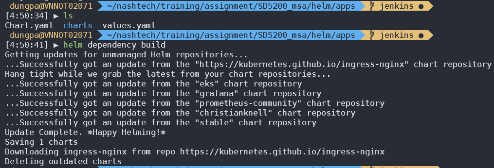
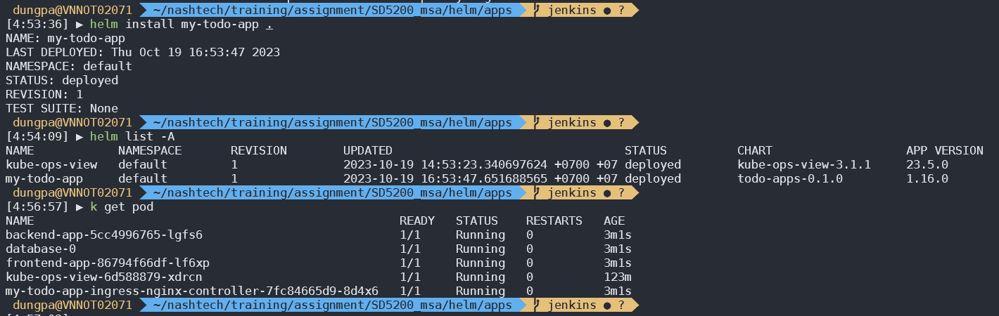
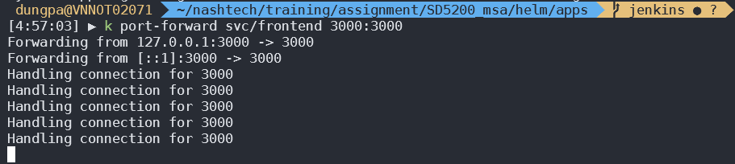
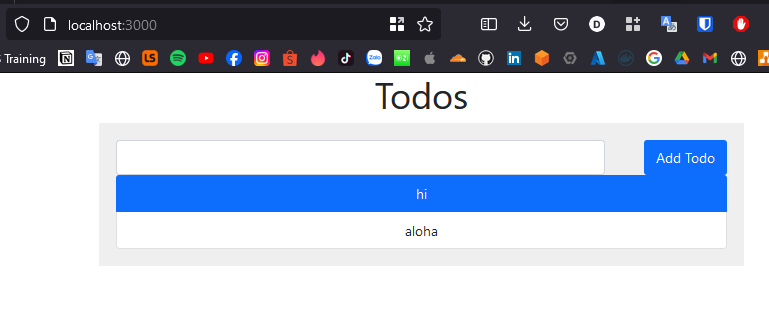
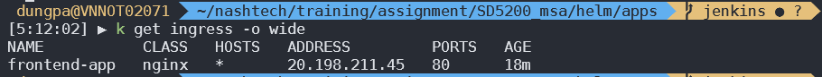
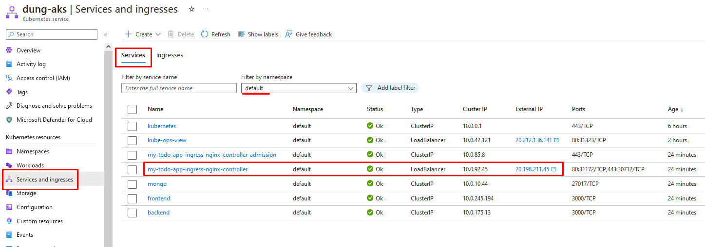
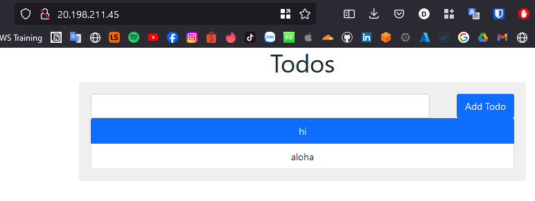

# Managed K8s with Helm

## Preparation

Here is structure

For each component we need to pay attention to the **values.yaml** file

<pre>
├── Chart.lock
├── Chart.yaml
├── charts
│   ├── backend
│   │   ├── Chart.yaml
│   │   ├── templates
│   │   │   ├── _helper.tpl
│   │   │   ├── deployment.yaml
│   │   │   └── service.yaml
│   │   └── values.yaml
│   ├── frontend
│   │   ├── Chart.yaml
│   │   ├── templates
│   │   │   ├──_helper.tpl
│   │   │   ├── deployment.yaml
│   │   │   ├── ingress.yaml
│   │   │   └── service.yaml
│   │   └── values.yaml
│   ├── ingress-nginx-4.6.1.tgz
│   └── mongodb
│       ├── Chart.yaml
│       ├── templates
│       │   ├── _helper.tpl
│       │   ├── configmap.yaml
│       │   ├── secret.yaml
│       │   ├── service.yaml
│       │   ├── statefulset.yaml
│       │   └── storageclass.yaml
│       └── values.yaml
└── values.yaml

7 directories, 23 files
</pre>

> :warning: The file _ingress-nginx-4.6.1.tgz_ was create after run `helm dependency build`

## Install app with helm

`helm dependency build`

`helm install my-todo-app .`

`kubectl port-forward svc/frontend 3000:3000`

Open browser to access application at URL: locahost:3000

<http://localhost:3000/>

Verify application ingress

Open browser to access application at URL or IP created by ingress controller

You can access AKS on Azure console

We have the same result as running with port-forward

