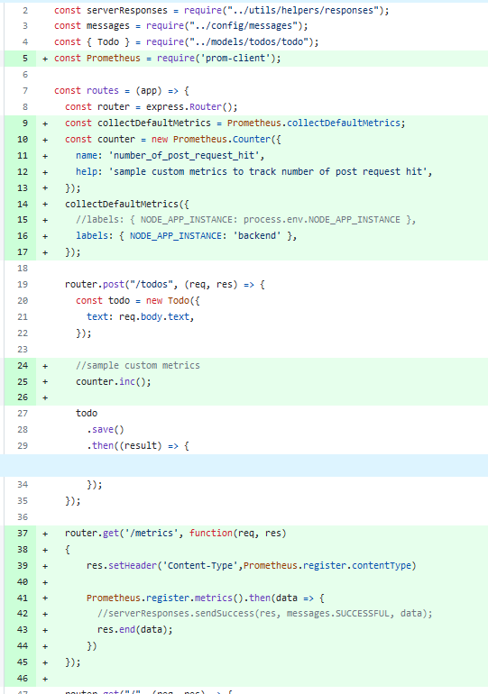

# SD5200_msa

[Managed K8s with Helm](https://github.com/dungpa45/SD5200_msa/tree/jenkins/helm)

This repo is used for both programs **DevOps for Devs** and **Pi-sharp**

and I use this Jenkins setup for both

## Installation

> You should choose the virtual machine have >=1vCPU and >=2Gb RAM

### Install Docker

```
sudo mkdir -p /etc/apt/keyrings
curl -fsSL https://download.docker.com/linux/ubuntu/gpg | sudo gpg --dearmor -o /etc/apt/keyrings/docker.gpg
echo \
  "deb [arch=$(dpkg --print-architecture) signed-by=/etc/apt/keyrings/docker.gpg] https://download.docker.com/linux/ubuntu \
  $(lsb_release -cs) stable" | sudo tee /etc/apt/sources.list.d/docker.list > /dev/null
sudo apt-get update -y
sudo apt-get install docker-ce docker-ce-cli containerd.io docker-compose-plugin -y

sudo usermod -aG docker $USER
grep docker /etc/group
sudo newgrp docker
sudo chmod 777 /var/run/docker.sock
```

### Install Jenkins

Using this image on dockerhub

<https://hub.docker.com/_/jenkins/>

`docker run --name myjenkins -p 8080:8080 -p 50000:50000 -v /your/home:/var/jenkins_home jenkins`

Or install Jenkins manually

<https://www.jenkins.io/doc/book/installing/linux/#debianubuntu>


#### Install plugin

- Docker Pipeline
- xUnit plugin
- Cobertura Plugin
- Code Coverage Plugin
- HTML Publisher plugin
- Pipeline Utility Steps
- Kubernetes plugin
- Kubernetes CLI Plugin
- Kubernetes Credentials Plugin

#### Install tools

- aws/azure cli
- [kubectl cli](https://kubernetes.io/vi/docs/tasks/tools/install-kubectl/)
- [docker](https://docs.docker.com/engine/install/ubuntu/)
- [trivy](https://aquasecurity.github.io/trivy/v0.18.3/installation/)

#### Setup require credentials for pipeline


## Setup Jenkins pipeline

Create a new item as the type is Pipeline and config like the image below


### Use Trivy in Jenkins

Using this code of stage below to use trivy in jenkins pipeline

```
stage('Trivy Scan Images') {
  agent any
  steps {
    // Install trivy
    sh 'curl -sfL https://raw.githubusercontent.com/aquasecurity/trivy/main/contrib/html.tpl > html.tpl'

    // Scan all vuln levels
    sh 'mkdir -p reports'
    sh "trivy image ${REPO_FE}:${IMAGE_TAG} --format template --template '@html.tpl' --severity HIGH -o reports/frontend-scan.html"

    // Scan again and fail on CRITICAL vulns
    sh "trivy image ${REPO_BE}:${IMAGE_TAG} --format template --template '@html.tpl' --severity HIGH -o reports/backend-scan.html"
    publishHTML target : [
      allowMissing: true,
      alwaysLinkToLastBuild: true,
      keepAll: true,
      reportDir: 'reports',
      reportFiles: 'backend-scan.html,frontend-scan.html',
      reportTitles: 'Backend Scan,Frontend Scan',
      reportName: 'Trivy Scan'
    ]
  }
}
```

We need get this file `html.tpl` to publish the report as HTML

Create folder to store html reports. The report we focus only HIGH severity.


`reportTitles: 'Backend Scan,Frontend Scan'` in order the html report in `reportFiles`


Images pushed on ACR


## Monitoring

### Prepare Code

#### We need modify some code in Backend with Prometheus to expose some metrics

Just add somethings like that in Backend `src/backend/routes/index.js`



and in Frontend `src/frontend/src/App.js`


And don't forget add `"prom-client": "^14.2.0"` module in package.json

Deploy with CICD, and we can get the new app look like


### Implement Tool

#### Use Istio to provide observability metrics, which can be visualized and collected using Grafana and Prometheus

[Install prometheus and grafana with helm chart](https://github.com/prometheus-community/helm-charts)

```
helm repo add prometheus-community https://prometheus-community.github.io/helm-charts 
helm repo add stable https://charts.helm.sh/stable 
helm repo update
helm repo list
```


Now we need pull to edit file values before install kube-prometheus-stack

```
helm pull prometheus-community/kube-prometheus-stack
tar -xzf kube-prometheus-stack-51.9.4.tgz
cp kube-prometheus-stack\values.yaml kube-prometheus-stack-values.yaml
```

Let's edit this file, and pay attention to the attributes below

```
    podMonitorSelectorNilUsesHelmValues: false 

    serviceMonitorSelectorNilUsesHelmValues: false 

    ruleSelectorNilUsesHelmValues: false

    ......

    additionalScrapeConfigs:
      - job_name: "Backend"
        scrape_interval: 15s
        metrics_path: /api/metrics
        static_configs:
          - targets:
            - backend:3000
```

Install with the edited file values

```
helm install -n monitoring prom prometheus-community/kube-prometheus-stack -f kube-prometheus-stack-values.yaml
```


By default, all of them not expose to internet, if we want to access via browser we need use `port-forward` of change the service type to `LoadBalancer`.

_Here, we use the first way, using `port-forward`_

```
kubectl port-forward -n monitoring svc/prom-grafana 80:61553
kubectl port-forward -n monitoring svc/prom-kube-prometheus-stack-prometheus 9090:61608
```

Login to Grafana with

```
kubectl get secrets -n monitoring prom-grafana -o jsonpath="{.data.admin-password}" | base64 --decode ; echo
```


Access to Prometheus we can fine the Backend service


In prometheus we find the custom metric has added by code above `number_of_post_request_hit` to see the number of post request


After that I have add 3 item in frontend


Now let's create the dashboard for Backend on Grafana


Add to Dashboard and we have a custom Dashboard for Backend service


#### Using Istio

[Install istioctl in local machine and istio in K8s](https://istio.io/latest/docs/setup/getting-started/#install)

```
curl -L https://istio.io/downloadIstio | sh -
cd istio-1.19.3
export PATH=$PWD/bin:$PATH
```

```
istioctl install --set profile=demo -y
kubectl label namespace default istio-injection=enabled
```

We need redeploy my app to take the effect, [For more information refer to the following here](https://istio.io/latest/docs/setup/additional-setup/sidecar-injection/)


I only have 1 pod for each of the following services. But after istio was install we have a istio-proxy (sidecar pod) for each service


Go in to folder istio we were download, and apply all addons

```
cd istio-1.19.3
kubectl apply -f samples/addons
kubectl rollout status deployment/kiali -n istio-system
istioctl dashboard kiali
```

Access to the browser


## Use GitOps for the CD pipeline

***Now we use Jenkins just for the CI step, CD will take place by argoCD***

### Install ArgoCD

```
kubectl create namespace argocd
kubectl apply -n argocd -f  https://raw.githubusercontent.com/argoproj/argo-cd/stable/manifests/install.yaml
```

[Install and use Argo CD Image Update](https://argocd-image-updater.readthedocs.io/en/stable/install/installation) This will help you listen to changes the image on ECR and update the image tag in Ops repo.

```
kubectl apply -n argocd -f https://raw.githubusercontent.com/argoproj-labs/argocd-image-updater/stable/manifests/install.yaml
```

Get password argocd

`kubectl -n argocd get secret argocd-initial-admin-secret -o jsonpath="{.data.password}" | base64 --decode`

Acesss browser localhost:8080

`kubectl port-forward svc/argocd-server -n argocd 8080:443`

### Using Image Updater

#### Now we have 2 way to create the application on ArgoCD: With UI and with file manifest

***With UI***


Add app in ArgorCD

- App Name: todo-app
- Project Name: default
- Repo URL: <https://github.com/dungpa45/SD5200_msa> (type: GIT)
- Revision: jenkins (type: Branches)
- Path: helm/apps
- Cluster URL: <https://kubernetes.default.svc>
- Namespace: default
- Helm section: Select the values file


Start Sync and wait a minute, you will get this


***With file manifest***

See the structure of this file as an example: [todo-app.yaml](../argocd/todo-app.yaml)

To using argocd image updater, we must add some annotation in your application

<https://argocd-image-updater.readthedocs.io/en/stable/configuration/images/#multiple-images-in-the-same-helm-chart>

For this case, we are using the way always to deploy the latest build by adding some annotations:

```
    argocd-image-updater.argoproj.io/image-list: frontend=dungacr.azurecr.io/devops-frontend, backend=dungacr.azurecr.io/devops-backend, mongodb=mongo
    argocd-image-updater.argoproj.io/frontend.update-strategy: latest
    argocd-image-updater.argoproj.io/frontend.allow-tags: regexp:^v1.0.0-[0-9a-zA-Z]+$
    argocd-image-updater.argoproj.io/backend.update-strategy: latest
    argocd-image-updater.argoproj.io/backend.allow-tags: regexp:^v1.0.0-[0-9a-zA-Z]+$
    argocd-image-updater.argoproj.io/mongodb.update-strategy: latest
    argocd-image-updater.argoproj.io/git-branch: jenkins
    argocd-image-updater.argoproj.io/write-back-method: git
```

Create a secret about docker login information and store in K8s

```
kubectl create secret -n argocd docker-registry acr-regcred --docker-server=xxx --docker-username=yyy --docker-password=zzz
```

Update configmap of the argocd-image-updater-config

```
kubectl get configmap --namespace argocd argocd-image-updater-config -o yaml > argocd-image-updater-config.yml
```

Add is code below to the bottom of the file

```
data:
  log.level: debug
  registries.conf: |
    registries:
    - name: DungACR
      prefix: dungacr.azurecr.io
      api_url: https://dungacr.azurecr.io
      credentials: pullsecret:argocd/acr-regcred
      default: true
```

```
kubectl apply -f argocd-image-updater-config.yml -n argocd
```

Restart the deployment of argocd-image-updater

```
kubectl -n argocd rollout restart deployment argocd-image-updater 
```

Make a change of the Frontend


Wait a minutes, and refresh the frontend site


### Blue/Green strategy for deployment

[Install argo rollout](https://argo-rollouts.readthedocs.io/en/stable/installation/)

```
kubectl create namespace argo-rollouts
kubectl apply -n argo-rollouts -f https://github.com/argoproj/argo-rollouts/releases/latest/download/install.yaml
```

